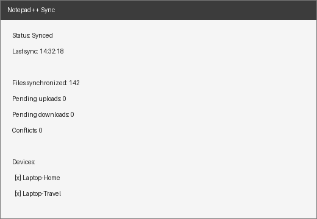

# Notepad++ Sync

**Synchronize your Notepad++ notes, files, and open tabs across Windows laptops — without Google Drive, OneDrive, Dropbox, or any third-party cloud.**

Notepad++ Sync is a native Notepad++ plugin plus a small self-hostable backend. You install the plugin, sign in once, pick the files and folders you care about, and then just use Notepad++ normally. Edits made and saved on Laptop A appear on Laptop B within seconds — quietly, in the background, end-to-end encrypted.

> Open laptop A → edit note → save. Open laptop B → the note is already there.
> No Drive folder. No Dropbox folder. No manual upload/download. No browser dashboard.



---

## Features

- **Native Notepad++ plugin** (C++, official plugin architecture) — menu under *Plugins → Notepad++ Sync*.
- **End-to-end encryption** — files are encrypted on your device with XChaCha20-Poly1305 (AES-256-GCM available) *before* upload. The server only ever stores opaque blobs. Filenames and paths are encrypted too.
- **Realtime sync** — WebSocket push notifications, with automatic fallback to periodic polling when the socket drops.
- **Real conflict handling** — never naïve last-write-wins. Divergent edits are detected by explicit version tracking (not timestamps), auto-merged with a three-way text merge when safe, and surfaced in a conflict UI otherwise. Nothing is silently discarded.
- **Offline-first** — full functionality without connectivity; changes queue locally in SQLite and reconcile on reconnect, surviving restarts and crashes.
- **Multi-device** — secure device pairing (pairing code) and an offline recovery key (`NPSYNC-XXXX-…`). View and revoke devices at any time.
- **Version history** — browse and restore recent versions of any file (configurable retention; 30 versions per file by default).
- **File selection** — sync individual files or whole folders, with `.gitignore`-style exclude rules and a local `.npsyncignore` file.
- **Session sync (optional)** — open tabs, selected tab, cursor and scroll positions. Unsaved documents are **never** uploaded by default.
- **Self-hosted or hosted** — point the plugin at the hosted service or at your own server (`docker compose up -d`). No external object storage required.
- **Privacy-first** — zero analytics or telemetry.

## Installation

### For users

1. Download the latest `NotepadPlusPlusSync-vX.Y.Z-win64.zip` from [Releases](../../releases).
2. Close Notepad++.
3. Extract the ZIP and copy `NppSync.dll` (and the bundled `deps\` folder, if present) into:
   ```
   C:\Program Files\Notepad++\plugins\NppSync\
   ```
4. Start Notepad++ → **Plugins → Notepad++ Sync → Sign In**.
5. Follow the first-run setup: create an account (or sign in), generate encryption keys, name this device, choose files/folders, done.

See the [User Guide](docs/user-guide.md) for details and screenshots.

### For self-hosters

```bash
git clone https://github.com/your-org/notepadpp-sync.git
cd notepadpp-sync
docker compose up -d
```

Then set the plugin's *Settings → Advanced → Backend URL* to `https://sync.myserver.com`. See [Self-hosting](docs/self-hosting.md).

## Basic usage

Everything lives under **Plugins → Notepad++ Sync**:

| Menu item        | What it does                                        |
|------------------|-----------------------------------------------------|
| Sign In / Out    | Authenticate with your account                      |
| Sync Now         | Force an immediate sync cycle                       |
| Sync Status      | Status window (state, last sync, pending ops, devices) |
| Manage Devices   | List / rename / revoke devices, pair a new device   |
| Synced Files/Folders | Manage sync roots and ignore rules              |
| Conflicts        | Resolve conflicts (Keep Local / Remote / Both / Compare / Manual Merge) |
| Settings         | General, Files, Session, Security, Advanced         |
| Pause Sync       | Temporarily suspend background sync                 |
| About            | Version and protocol information                    |

A small status indicator shows `Synced`, `Syncing`, `Offline`, `Conflict`, or `Error`.

## Security model (summary)

- **Auth and encryption are separate.** Passwords are hashed with Argon2id and used only for authentication. File encryption uses a master key generated locally on first setup; the server never sees it, your password, or your recovery key.
- Files are encrypted client-side with XChaCha20-Poly1305; metadata (names, paths) is encrypted as well. The server stores account IDs, opaque file IDs, ciphertext, sizes, and version vectors only.
- Access tokens expire; refresh tokens are revocable per device. Login endpoints are rate-limited with brute-force protection.
- Losing **all** devices **and** the recovery key means your encrypted data is unrecoverable — there is deliberately no server-side password reset that can decrypt your files.

Full details: [Security model](docs/security-model.md) and [SECURITY.md](SECURITY.md).

## Architecture

```
notepadpp-sync/
├── plugin/      Native Notepad++ plugin (C++17, CMake, WinHTTP, SQLite, CNG/libsodium)
├── server/      Sync backend (Go, PostgreSQL, WebSocket, pluggable blob storage)
├── protocol/    Versioned wire protocol schemas and docs (X-NPSync-Protocol: 1)
├── installer/   Packaging scripts (ZIP + NSIS)
├── docs/        User and developer documentation
└── .github/     CI / release workflows
```

High-level data flow:

1. Plugin A detects a save, hashes the file, encrypts it locally, uploads the new encrypted version.
2. The server stores the blob, advances the file's version vector, and emits a change event.
3. Plugin B receives the push, downloads the ciphertext, decrypts locally, three-way-merges if needed, and atomically replaces the local file (temp-write → hash-verify → rename).

Details: [Architecture](docs/architecture.md), [Protocol v1](protocol/docs/protocol-v1.md).

## Building from source

### Server

```bash
cd server
go build ./cmd/server
go test ./...
```

Requires Go 1.22+. Local dependencies (PostgreSQL) via:

```bash
docker compose -f docker-compose.dev.yml up -d
```

### Plugin

```bash
cd plugin
cmake -B build -A x64
cmake --build build --config Release
ctest --test-dir build -C Release
```

Requires Windows, MSVC (Visual Studio 2022), CMake ≥ 3.20. Dependencies (SQLite, nlohmann/json, libsodium) are fetched automatically by CMake.

See [Developer docs](docs/developer.md).

## Contributing

Contributions are welcome — see [CONTRIBUTING.md](CONTRIBUTING.md). By participating you agree to the [Code of Conduct](CODE_OF_CONDUCT.md).

## FAQ

**Does the server ever see my notes?**
No. Everything is encrypted on your device before upload. See the [security model](docs/security-model.md).

**What happens if two laptops edit the same file at once?**
Both versions are detected as divergent edits of the same base version. Text files are auto-merged when the edits don't overlap; otherwise the conflict appears in the Conflicts window with Keep Local / Keep Remote / Keep Both / Compare / Manual Merge options. Neither version is ever lost.

**Does it work offline?**
Yes. Changes are queued locally and synchronized when connectivity returns. The queue survives restarts.

**What about unsaved "new 1" tabs?**
They are never uploaded by default. An explicit, clearly-warned *Sync Unsaved Notes* option exists for users who want it.

**Can I sync my whole Notepad++ config?**
No, deliberately. Only explicitly supported session state (open tabs, cursor/scroll) is synchronized.

**I lost my laptop. How do I secure my account?**
*Manage Devices → Revoke*. The device's refresh token dies immediately.

## License

[MIT](LICENSE)
