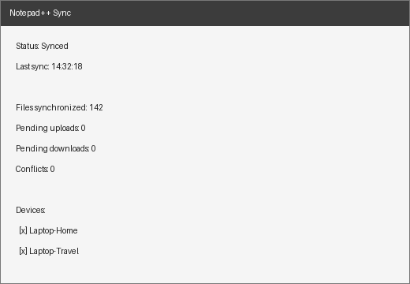

# Notepad++ Sync

**Synchronize your Notepad++ notes, files, and open tabs across Windows laptops — without Google Drive, OneDrive, Dropbox, or any third-party cloud.**

Notepad++ Sync is a native Notepad++ plugin plus a small self-hostable backend. You install the plugin, sign in once, pick the files and folders you care about, and then just use Notepad++ normally. Edits made and saved on Laptop A appear on Laptop B within seconds — quietly, in the background, end-to-end encrypted.

> Open laptop A → edit note → save. Open laptop B → the note is already there.
> No Drive folder. No Dropbox folder. No manual upload/download. No browser dashboard.



---

## Features

- **Native Notepad++ plugin** (C++, official plugin architecture) — menu under *Plugins → Notepad++ Sync*.
- **End-to-end encryption** — files are encrypted on your device with AES-256-GCM *before* upload. The server only ever stores opaque blobs. Filenames and paths are encrypted too.
- **Realtime sync** — WebSocket push notifications, with automatic fallback to periodic polling when the socket drops.
- **Real conflict handling** — never naïve last-write-wins. Divergent edits are detected by explicit version tracking (not timestamps), auto-merged with a three-way text merge when safe, and surfaced in a conflict UI otherwise. Nothing is silently discarded.
- **Offline-first** — full functionality without connectivity; changes queue locally in SQLite and reconcile on reconnect, surviving restarts and crashes.
- **Multi-device** — a second computer receives the existing encryption key when you allow it (a short code, wrapped so the server cannot read the key). View and revoke devices at any time. A recovery key shown on the first computer stays on that Windows user; it does not unlock another PC.
- **Version history** — browse and restore recent versions of any file (configurable retention; 30 versions per file by default).
- **File selection** — sync individual files or whole folders, with `.gitignore`-style exclude rules and a local `.npsyncignore` file.
- **Session sync (optional)** — open tabs, selected tab, cursor and scroll positions. Unsaved documents are **never** uploaded by default.
- **Ready to use, and self-hostable** — a fresh install talks to `https://sync.berkkarabacak.com`. You do not type a server address. Self-hosters can point the plugin at their own server under *Settings → Advanced → Backend URL* (for example `http://localhost:8080`), choose **Save**, and restart Notepad++. **Save** does not retarget a Notepad++ process that is already running. No external object storage required.
- **Privacy-first** — zero analytics or telemetry.

## Installation

### For users

1. Download `NotepadPlusPlusSync-vX.Y.Z-win64-setup.exe` from [Releases](../../releases).
2. Double-click it.
3. If Windows says it protected your PC, choose **More info**, then **Run anyway**. The download is not signed yet.
4. If Windows asks "Do you want to allow this app to make changes?", choose **Yes**. That only lets the installer copy the plugin into the Notepad++ folder.
5. Choose **Next**, then **Install**. The installer finds 64-bit Notepad++ (in `C:\Program Files\Notepad++`, or in your user folder if Notepad++ was installed only for you).
6. If Notepad++ is open, choose **Yes** only when you are ready for it to close. Notepad++ will ask you to save unsaved notes. The installer does not force it to quit. Choose **No** to stop, close Notepad++ yourself, and run the installer again.
7. Open Notepad++. **Plugins → Notepad++ Sync** is in the menu.
   A fresh install uses `https://sync.berkkarabacak.com`. You do not type a server address.
8. Follow the first-run setup: **Sign in with Google** (or email and password, for an existing account). On the first computer, an encryption key is created on that PC. On a second computer, say the notes are already elsewhere and let the first computer allow it. Name this device, choose files/folders, done.

The ZIP is still published for anyone who cannot run the setup program. Close Notepad++, then copy `NppSync.dll` (and `deps\`, if that folder is in the ZIP) into `plugins\NppSync` under the folder that contains `notepad++.exe`. Create `plugins\NppSync` if it is not there. A normal install uses `C:\Program Files\Notepad++\plugins\NppSync\`.

See the [User Guide](docs/user-guide.md) for details and screenshots.

### For self-hosters

```bash
git clone https://github.com/berkkarabacak/notepadpp-sync.git
cd notepadpp-sync
cp .env.example .env
# set POSTGRES_PASSWORD, TOKEN_SIGNING_KEY, and BASE_URL
docker compose up -d
```

For a laptop demo, `BASE_URL=http://localhost:8080`. The plugin ships pointed at `https://sync.berkkarabacak.com`, so set **Settings → Advanced → Backend URL** to that same `http://localhost:8080`, choose **Save**, and restart Notepad++. **Save** does not retarget a Notepad++ process that is already running. Optional Google sign-in uses `GOOGLE_CLIENT_ID`, `GOOGLE_CLIENT_SECRET`, and `GOOGLE_REDIRECT_URI`. See [Self-hosting](docs/self-hosting.md).

## Basic usage

Everything lives under **Plugins → Notepad++ Sync**:

| Menu item        | What it does                                        |
|------------------|-----------------------------------------------------|
| Sign In / Out    | Sign in with Google, or with email and password    |
| Sync Now         | Force an immediate sync cycle                       |
| Sync Status      | Status window (state, last sync, pending ops, devices) |
| Allow another computer | On the computer that already has the notes: type the code from the new computer |
| Get my notes     | On the new computer: show a code and wait until the key arrives |
| Manage Devices   | List / rename / revoke devices; the same two actions as above |
| Synced Files/Folders | Manage sync roots and ignore rules              |
| Conflicts        | Resolve conflicts (Keep Local / Remote / Both / Compare / Manual Merge) |
| Settings         | General, Files, Session, Security, Advanced         |
| Pause Sync       | Temporarily suspend background sync                 |
| About            | Version and protocol information                    |

A small status indicator shows `Synced`, `Syncing`, `Offline`, `Conflict`, or `Error`.

## Security model (summary)

- **Auth and encryption are separate.** Google sign-in (and email/password, where you still use it) only authenticates the account. File encryption uses a master key generated on the first computer; the server never sees it, your Google tokens, your password, or your recovery key. A second computer gets that key only when the first computer allows it. The recovery key stored for the first Windows user does not unlock the second computer.
- Files are encrypted client-side with AES-256-GCM; metadata (names, paths) is encrypted as well. The server stores account IDs, opaque file IDs, ciphertext, sizes, and version vectors only.
- Access tokens expire; refresh tokens are revocable per device. Login endpoints are rate-limited with brute-force protection.
- If every computer that holds the master key is lost before another computer is allowed, the notes on the server cannot be read. There is no server-side reset. The recovery key on the first computer does not replace that.

Full details: [Security model](docs/security-model.md) and [SECURITY.md](SECURITY.md).

## Architecture

```
notepadpp-sync/
├── plugin/      Native Notepad++ plugin (C++17, CMake, WinHTTP, SQLite, Windows CNG)
├── server/      Sync backend (Go, PostgreSQL, WebSocket, pluggable blob storage)
├── protocol/    Versioned wire protocol schemas and docs (X-NPSync-Protocol: 1)
├── installer/   Packaging scripts (ZIP + NSIS)
├── docs/        User and developer documentation
└── .github/     CI / release workflows
```

High-level data flow:

1. Plugin A detects a save, hashes the file, encrypts it locally, uploads the new encrypted version.
2. The server stores the blob, advances the file's version vector, and emits a change event.
3. Plugin B receives the push, downloads the ciphertext, decrypts locally, three-way-merges if needed, and atomically replaces the local file (temp-write → hash-verify → rename).

Details: [Architecture](docs/architecture.md), [Protocol v1](protocol/docs/protocol-v1.md).

## Building from source

### Server

```bash
cd server
go build ./cmd/server
go test ./...
```

Requires Go 1.25 (see `server/go.mod`). Local dependencies (PostgreSQL) via:

```bash
docker compose -f docker-compose.dev.yml up -d
```

### Plugin

```bash
cd plugin
cmake -B build -A x64
cmake --build build --config Release
ctest --test-dir build -C Release
```

Requires Windows, MSVC (Visual Studio 2022), CMake ≥ 3.20. Dependencies (SQLite, nlohmann/json) are fetched automatically by CMake. Encryption uses Windows CNG (AES-256-GCM); libsodium is not a dependency.

See [Developer docs](docs/developer.md).

## Contributing

Contributions are welcome — see [CONTRIBUTING.md](CONTRIBUTING.md). By participating you agree to the [Code of Conduct](CODE_OF_CONDUCT.md).

## FAQ

**Does the server ever see my notes?**
No. Everything is encrypted on your device before upload. See the [security model](docs/security-model.md).

**What happens if two laptops edit the same file at once?**
Both versions are detected as divergent edits of the same base version. Text files are auto-merged when the edits don't overlap; otherwise the conflict appears in the Conflicts window with Keep Local / Keep Remote / Keep Both / Compare / Manual Merge options. Neither version is ever lost.

**Does it work offline?**
Yes. Changes are queued locally and synchronized when connectivity returns. The queue survives restarts.

**What about unsaved "new 1" tabs?**
They are never uploaded by default. An explicit, clearly-warned *Sync Unsaved Notes* option exists for users who want it.

**Can I sync my whole Notepad++ config?**
No, deliberately. Only explicitly supported session state (open tabs, cursor/scroll) is synchronized.

**I lost my laptop. How do I secure my account?**
*Manage Devices → Revoke*. The device's refresh token dies immediately.

## License

[MIT](LICENSE)
